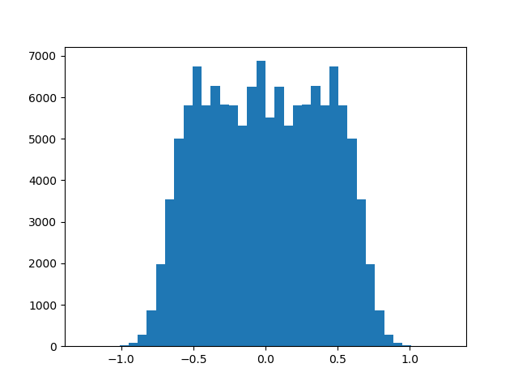
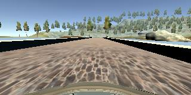
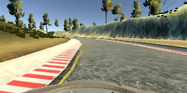
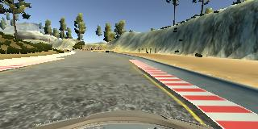
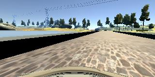
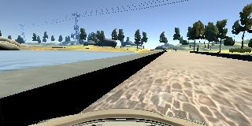
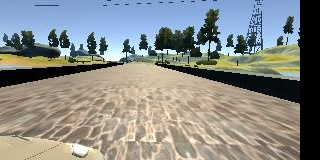
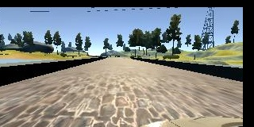

# **Behavioral Cloning** 

---

**Behavioral Cloning Project**

The goals / steps of this project are the following:
* Use the simulator to collect data of good driving behavior
* Build, a convolution neural network in Keras that predicts steering angles from images
* Train and validate the model with a training and validation set
* Test that the model successfully drives around track one without leaving the road
* Summarize the results with a written report


## Rubric Points
### Here I will consider the [rubric points](https://review.udacity.com/#!/rubrics/432/view) individually and describe how I addressed each point in my implementation.  

---
### Files Submitted & Code Quality

#### 1. Submission includes all required files and can be used to run the simulator in autonomous mode

My project includes the following files:
* model.py containing the script to create and train the model
* drive.py for driving the car in autonomous mode
* model.h5 containing a trained convolution neural network 
* writeup.md summarizing the results
* video_output.mp4 showing the car driving 2 rounds on track 1

#### 2. Submission includes functional code
Using the Udacity provided simulator and my drive.py file, the car can be driven autonomously around the track by executing 
```sh
python drive.py model.h5
```

#### 3. Submission code is usable and readable
The model.py file contains the code for training and saving the convolution neural network. The file shows the pipeline I used for training and validating the model, and it contains comments to explain how the code works.


### Model Architecture and Training Strategy

#### 1. An appropriate model architecture has been employed

My model consists of a convolution neural network with 5x5 and 3x3 filter sizes, respectively, and depths between 24 and 64 (model.py lines 180-184) 

The model includes RELU layers to introduce nonlinearity (code line 180-184), and the data is normalized in the model using a Keras lambda layer (code line 178). 

#### 2. Attempts to reduce overfitting in the model

The model contains a dropout layers in order to reduce overfitting (model.py lines, 186, 188, 190). 

The model was trained and validated on different data sets to ensure that the model was not overfitting (code line 114-139). 
The model was tested by running it through the simulator and ensuring that the vehicle could stay on the track.

#### 3. Model parameter tuning

The model used an adam optimizer, so the learning rate was not tuned manually (model.py line 197).

#### 4. Appropriate training data

Training data was chosen to keep the vehicle driving on the road. I used a combination of center lane driving, left lane driving, and right line driving.

For details about how I created the training data, see the next section. 

### Model Architecture and Training Strategy

#### 1. Solution Design Approach

The overall strategy for deriving a model architecture was to use an existing architecture that has proven to work. I used the nvidia model because
it was mentioned in class.My first steps were to train the data only with provided data, and then added trainin data where necessary. This
result of this approach was very unreliable, sometimes the car left the track at the first turn, sometimes crashed on the bridge, or did a complete round but touched the road markings. 

The first reviewer pointed me to this website https://medium.com/@ksakmann/behavioral-cloning-make-a-car-drive-like-yourself-dc6021152713, which links to this website https://chatbotslife.com/using-augmentation-to-mimic-human-driving-496b569760a9#.jqcy5fcw6.
The second link was actually more helpful to me. So, I tried to get the same number of of examples for each steering angle. After preprossing the data, the histogram looks like this.



After playing around with the model and the simulator for a while I realized that training the model for more than 2 to 3 epochs does not improve the model. I only trained for two epochs, ran 
the simulator and then trained for one more epoch.

The final step was to run the simulator to see how well the car was driving around track one. 
At the end of the process, the vehicle is able to drive autonomously around the track without leaving the road.

#### 2. Final Model Architecture

The final model architecture (model.py lines 159-172) is shown in the table below.

|Layer (type)       		|          Output Shape |     Param #|   
|---------------------------|---------------------------|---------|
|lambda_1 (Lambda)          |  (None, 160, 320, 3)      | 0         |
|cropping2d_1 (Cropping2D)  |  (None, 65, 320, 3)       | 0        | 
|conv2d_1 (Conv2D)          |  (None, 31, 158, 24)      | 1824     | 
|conv2d_2 (Conv2D)          |  (None, 14, 77, 36)       | 21636    | 
|conv2d_3 (Conv2D)          |  (None, 5, 37, 48)        | 43248    | 
|conv2d_4 (Conv2D)          |  (None, 3, 35, 64)        | 27712    | 
|conv2d_5 (Conv2D)          |  (None, 1, 33, 64)        | 36928    | 
|flatten_1 (Flatten)        |  (None, 2112)             | 0        | 
|dropout_1 (Dropout)        |  (None, 2112)             | 0        | 
|dense_1 (Dense)            |  (None, 100)              | 211300   | 
|dense_2 (Dense)            |  (None, 50)               | 5050     | 
|dense_3 (Dense)            |  (None, 10)               | 510      | 
|dense_4 (Dense)            |  (None, 1)                | 11       | 

Total params: 348,219
Trainable params: 348,219
Non-trainable params: 0

#### 3. Creation of the Training Set & Training Process

To capture good driving behavior, I used the provided dataset. Here is an example image of center lane driving:





I then recorded the vehicle driving the left side and right sides of the road. Instead of doing recovery driving I added or subtracted higher steering wheel angles to these images:





One challenging part was the bridge, so I presented the bridge images several times to the network. Furthermore I recorded images while the car was on the bridge turned slightly to the left.
(After doing data augmentation I am not sure if these training images are still needed.)



Shifting the input images (model.py, line 21)in x and y direction and randomly removing images with a ateering angle around 0 (model.py, line 54). Other data augmentation methods
mentioned on the websites, like changing brightness of the training images, did not make sense to me because brightness never changes in the simulator. 





To further augment the data set and get an even distribution of negavtive and positive steering angles, I also flipped images (see model.py, lines 71, 81, 87).


After the collection process, I had 14771 images (without flipping and shifting) and 131454 data points after data augmentation.

I finally randomly shuffled the data set and put 15% (model.py, line 157) of the data into a validation set. 

I used this training data for training the model. The validation set helped determine if the model was over or under fitting. Three epochs were sufficient to learn a good driving behavior. I used an adam optimizer so that manually training the learning rate wasn't necessary.
